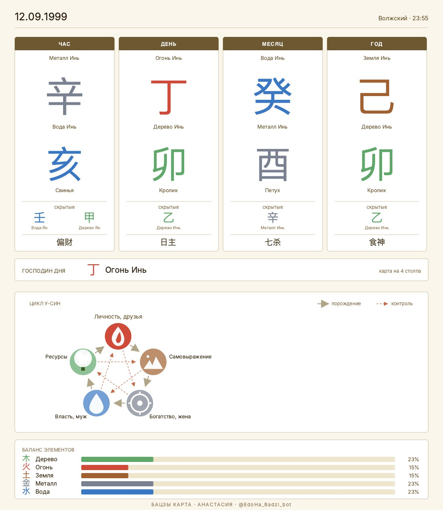
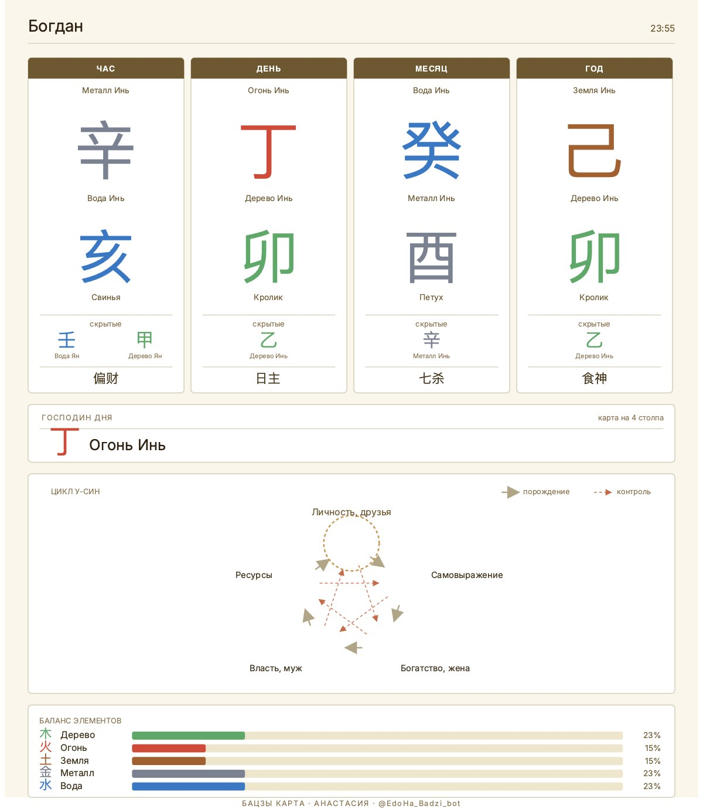

# БаЦзы-Бот — Бэклог задач

> Статус: 🚀 Live на YC VM 130.193.51.15 как @EdoHa_Badzi_bot (2026-05-08)
> Методология: AIDD → Plan → Agree → Implement → Verify → Commit

---

## ✅ Выполнено

### Подготовительные задачи
- [x] **P-1** 24 PNG-ассета иероглифов (10 стволов + 12 ветвей + 2 Инь/Ян) в стиле Mingli
- [x] **P-3** YC-аккаунт + `yc` CLI; ресурсы созданы (PostgreSQL, Redis, VPS, Object Storage)
- [x] **P-4** Gemini Deep Research по 6 архитектурным вопросам ([doc/gemini_research.md](doc/gemini_research.md))
- [x] **P-5** Скаффолд директорий (`tests/`, `knowledge/`, `monitoring/`, `web/`, `tasks/`)

### Этап 1 MVP — закрытое

#### 1.1 Инфраструктура проекта
- [x] 1.1.1 `pyproject.toml` (ruff, mypy, pytest, pytest-asyncio)
- [x] 1.1.2 `.pre-commit-config.yaml` (ruff + mypy + secret scan)
- [x] 1.1.3 Dockerfile (python:3.11-slim + gcc для pyswisseph)
- [x] 1.1.4 docker-compose.yml (bot + worker + postgres + redis)
- [x] 1.1.5 GitHub Actions CI/CD ([.github/workflows/ci.yml](.github/workflows/ci.yml))

#### 1.2 Конфигурация и логирование
- [x] 1.2.1 [bot/config.py](bot/config.py) — Pydantic Settings (все env vars из `.env.example`)
- [x] 1.2.2 structlog (JSON-формат, trace_id биндинг)
- [x] 1.2.3 [bot/middlewares/tracing.py](bot/middlewares/tracing.py) — trace_id middleware

#### 1.3 База данных
- [x] 1.3.1 [db/engine.py](db/engine.py) — async PostgreSQL engine + session factory
- [x] 1.3.2 [db/models.py](db/models.py) — SQLAlchemy модели (User, Chart, Consultation, Subscription, Event)
- [x] 1.3.3 Alembic init (`migrations/env.py`, `alembic.ini`)
- [x] 1.3.4 Первая миграция: `create_initial_tables` (revision `151398db4f39`)
- [x] 1.3.5 [db/repositories/](db/repositories/) — UserRepo, ChartRepo, ConsultationRepo, SubscriptionRepo

#### 1.4 Калькулятор Бацзы (stateless ядро)
- [x] 1.4.1 [calculator/models.py](calculator/models.py) — ChartInput, ChartOutput (Pydantic)
- [x] 1.4.2 [calculator/swiss.py](calculator/swiss.py) — pyswisseph + JPL DE431
- [x] 1.4.3 [calculator/true_solar_time.py](calculator/true_solar_time.py) — TST: LMT + EoT + DST + longitude
- [x] 1.4.4 [calculator/solar_terms.py](calculator/solar_terms.py) — 24 Цзе Ци
- [x] 1.4.5 [calculator/pillars.py](calculator/pillars.py) — 4 столпа (年月日時), 60-цикл
- [x] 1.4.6 [calculator/hidden_stems.py](calculator/hidden_stems.py) — 3 школы (Traditional, Modern, Ken Lai)
- [x] 1.4.7 [calculator/ten_gods.py](calculator/ten_gods.py) — 10 Божеств
- [x] 1.4.8 [calculator/day_master.py](calculator/day_master.py) — Сила ДМ
- [x] 1.4.9 Тесты калькулятора — покрытие 80%+

#### 1.5 Telegram Bot — базовая структура
- [x] 1.5.1 [bot/main.py](bot/main.py) — entry point, диспетчер, middleware, роутеры
- [x] 1.5.2 [bot/middlewares/db_session.py](bot/middlewares/db_session.py)
- [x] 1.5.3 [bot/middlewares/user_middleware.py](bot/middlewares/user_middleware.py) — get_or_create
- [x] 1.5.4 [bot/states.py](bot/states.py) — FSM (BirthDataForm, ConsultationState)
- [x] 1.5.5 [bot/keyboards/](bot/keyboards/) — inline клавиатуры

#### 1.6 FSM — Сбор данных рождения
- [x] 1.6.1 [bot/routers/start.py](bot/routers/start.py) — /start, приветствие Анастасии (Variant B)
- [x] 1.6.2 FSM шаг 1: дата рождения (валидация формата)
- [x] 1.6.3 FSM шаг 2: время рождения (с вариантом «не знаю»)
- [x] 1.6.4 FSM шаг 3: город → geopy → координаты → timezonefinder (top-3 inline)
- [x] 1.6.5 FSM шаг 4: пол + сводка
- [x] 1.6.6 Подтверждение → `calculate_chart` → Chart в БД

#### 1.7 Визуальная карта (CairoSVG + Pillow + ProcessPool)
- [x] 1.7.1–1.7.2 v1 Playwright (legacy, deprecated)
- [x] 1.7.4 Отправка фото в Telegram (BufferedInputFile)
- [x] 1.7.6 [ai/svg_renderer.py](ai/svg_renderer.py) — Jinja2 → SVG → CairoSVG → PNG pipeline
- [x] 1.7.7 [web/templates/chart.svg.j2](web/templates/chart.svg.j2) — light Mingli grid + цвета стихий
- [x] 1.7.8 У-син пентагон с подсветкой ДМ (radius 130, безье-стрелки порождения/контроля)
- [x] 1.7.9 [ai/_render_pool.py](ai/_render_pool.py) — `ProcessPoolExecutor` (`RENDER_POOL_SIZE` или `cpu_count()//2`)
- [x] 1.7.10 Playwright удалён из deps + Dockerfile (-150 MB образа)
- [x] 1.7.11 [doc/benchmarks/render.md](doc/benchmarks/render.md) — bench: pool=4 даёт 2× rps на N=200

#### 1.8 AI Оркестратор (OpenRouter) — закрыт 2026-05-07
- [x] 1.8.1 [ai/orchestrator.py](ai/orchestrator.py) — OpenRouter клиент (httpx async, иерархия исключений). 15 unit-тестов.
- [x] 1.8.2 [ai/prompts/anastasia_system.md](ai/prompts/anastasia_system.md) — 39 KB, `load_system_prompt()` с `lru_cache`. 4 теста.
- [x] 1.8.3 [ai/router.py](ai/router.py) — semantic router (simple/normal/complex, cyrillic-aware). 17 тестов.
- [x] 1.8.4 [ai/context.py](ai/context.py) — `HistoryStore` поверх Redis, TTL 24h, max 20 msgs. 8 тестов.
- [x] 1.8.5 [ai/fallback.py](ai/fallback.py) — `chat_with_fallback`: primary → fallback на 429/5xx. 6 тестов.
- [x] 1.8.6 [ai/temporal_context.py](ai/temporal_context.py) — `compose_messages()` с system + history + chart + temporal. 9 тестов.

#### 1.10 Базовая интерпретация (6 блоков, всегда бесплатно) — закрыт 2026-05-07
- [x] 1.10.1 [ai/base_interpretation.py](ai/base_interpretation.py) — генератор 6 блоков одним вызовом, `parse_blocks` regex, `format_for_telegram` HTML-форматирование. 11 тестов.
- [x] 1.10.2–1.10.7 Шесть блоков: «Баланс пяти стихий», «Господин Дня — личность», «Реализация по кругу порождения», «Идеальный партнёр», «Сильные стороны карты», «Влияние текущего года».
- [x] 1.10.8 `format_for_telegram` + `_strip_exclaim` (защита от `!`).

#### 1.11 TaskIQ инфраструктура — закрыт 2026-05-07
- [x] 1.11.1 [tasks/broker.py](tasks/broker.py) — `ListQueueBroker` поверх Redis, TTL результатов 1ч.
- [x] 1.11.2 [tasks/consultation.py](tasks/consultation.py) — `run_consultation()` для будущих тяжёлых запросов (>30s).
- [x] 1.11.3 [docker-compose.yml](docker-compose.yml) `worker` сервис.

#### 1.13 Консультация — диалог с Анастасией — закрыт 2026-05-07, доработан 2026-05-08
- [x] 1.13.1 [bot/routers/consultation.py](bot/routers/consultation.py) — `handle_ask_pressed`, `handle_question`, `handle_reset`.
- [x] 1.13.2 Контекст через `compose_messages()` (system + history + chart + temporal? + question).
- [x] 1.13.3 Детектор временных вопросов через `route()`.
- [x] 1.13.4 Typing-индикатор `_keep_typing()` каждые 4 сек.
- [x] 1.13.5 Сохранение в `Consultation` со всеми полями телеметрии.
- [x] 1.13.X **Bonus:** [bot/middlewares/history.py](bot/middlewares/history.py) — `HistoryMiddleware`. 7 тестов.
- [x] **1.13.6 (2026-05-08)** UI: `chart_actions_kb` («Получить разбор карты», «Задать вопрос по карте», «В меню») на фото карты. `handle_ask_pressed` использует `message.answer` вместо `edit_text`. `chart_id` пиннится в FSM при `chart:open`.
- [x] **1.13.7 (2026-05-08)** Навигация: `menu:back`, `menu:pricing`, `pay:*` хендлеры (тарифы пока заглушка).
- [x] **1.13.8 (2026-05-08)** Свитч на Claude 3.5 Sonnet (latency 55s → ~5-10s) + strict-cite в `_INSTRUCTION` против context-leakage.

#### 1.16 Деплой MVP — частично (3 из 6 пунктов)
- [x] 1.16.1 YC ресурсы созданы (VPS, PostgreSQL, Redis, Object Storage) — 2026-05-02
- [x] 1.16.3 Миграции Alembic накатаны на managed PG (revision `151398db4f39 (head)`, подтверждено SSH-аудитом 2026-05-08)
- [x] **1.16.6 (2026-05-08)** Live-bot на YC VM: контейнеры `badzi_bot-bot-1` + `badzi_bot-worker-1` healthy, доступен в Telegram как `@EdoHa_Badzi_bot`

### Этап 2 — закрытое

#### 2.1 Калькулятор — расширение
- [x] 2.1.1 [calculator/luck_pillars.py](calculator/luck_pillars.py) — Столпы Удачи (大運) до минуты + `start_datetime`
- [x] 2.1.2 [calculator/interactions.py](calculator/interactions.py) — 9 типов взаимодействий 合沖刑害破
- [x] 2.1.3 [calculator/symbolic_stars.py](calculator/symbolic_stars.py) — 60 классических Шэнь Ша в 7 категориях
- [x] 2.1.4 [calculator/auxiliary.py](calculator/auxiliary.py) — 胎元 (Тай Юань) + 命宫 (Мин Гун)
- [x] 2.1.5 [calculator/structures.py](calculator/structures.py) — 25 格局 каскадный priority 化→从→一气→月令-special→正格

#### 2.1.6 Воспроизводимость калькулятора — закрыт 2026-05-07
**Итог:** калькулятор детерминирован (1000/1000 одинаковых результатов в одном процессе и между процессами). «Плавание» в MASTER.md полностью объяснено парой `(tz_offset, early_rat)` — DST-aware tz_offset для 1999 = 4.0, не 3.0. Регрессионные тесты: [tests/unit/test_calculator/test_determinism.py](tests/unit/test_calculator/test_determinism.py) и [tests/unit/test_bot/test_birth_datetime.py](tests/unit/test_bot/test_birth_datetime.py). Отдельный вопрос точности (наш `丁卯` vs классический эталон `丁亥`) — задача 2.1.7.

---

## 🔴 Текущая итерация (live-fix wave + минимальная защита перед релизом)

### 🟡 L. После live-теста на проде
- [ ] **L-1 Эмодзи в SVG-карте.** На проде эмодзи 🌳🔥⛰⚙💧 не рендерятся (видны белые SVG-плейсхолдеры). Twemoji не подходит (тусклый). Нужен другой 3D-emoji-шрифт. План: рекомендация Gemini по open-source 3D-эмодзи (Microsoft Fluent Emoji 3D / JoyPixels / Apple Color Emoji extracted) → установка в Dockerfile через `apt`/`curl` + fontconfig alias → проверка через `BAZI_DEBUG_DUMP_SVG=1` → деплой.
- [ ] **L-2 Live-валидация Claude Sonnet.** После коммита `ff21ef2` проверить в Telegram: latency ~10с (вместо 55), баланс стихий цитируется дословно (15% Огня, не 40%), стиль Анастасии сохранился (тёплый, без `!`).

### 🟢 1.12.0 Минимальный free-question guard (защита от безлимитного жжения токенов)
- [x] **1.12.0** `User.free_question_used` флаг + проверка в `handle_question`: первый вопрос → флаг `True`, второй → заглушка «оплата подключается» через `pricing_kb`. **Зафиксировано в [bot/routers/consultation.py:241-255](bot/routers/consultation.py#L241-L255), admin-skip через `pricing:skip`.** Сделано до Wave 6.

### 🌊 1.17 Wave 6: AI Skill-Router (ADR-010) — Phase 0-6 закрыты 2026-05-19

- [x] **1.17.0 Phase 0** — prompt surgery + Qwen3-3B probe + 9-блочная база-интерпретация ([base.md](ai/prompts/base.md) 12 KB, 5×`ai/skills/*.md`, [base_interpretation.py](ai/base_interpretation.py) 6→9 блоков с follow-up «**Дальше можно спросить:**»). Пункты 8+9 Богдана. Commit `25f16c9`.
- [x] **1.17.1 Phase 1** — `ai/skills/` каталог + Pydantic SkillSpec/SkillSelection + frontmatter loader. 25 тестов. Commit `25f16c9`.
- [x] **1.17.2 Phase 2** — [ai/skill_router.py](ai/skill_router.py) `select_skill` (Qwen3.6 max_tokens=2000, JSON output, graceful fallback). [skill_router_system.md](ai/prompts/skill_router_system.md) с 6 few-shot. [orchestrator.py](ai/orchestrator.py) `chat` теперь принимает опц. `response_format`. 11 тестов. Commit `25f16c9`.
- [x] **1.17.3 Phase 3** — `charts.partner_chart_id` UUID NULL FK self (migration `5c7804a9c2c3`), `ChartRepository.set_partner`, [birth_data.handle_add_partner_chart](bot/routers/birth_data.py) entry + `mode="partner"` flow в `_calculate_and_persist`. 9 тестов. Commit `e95f200`.
- [x] **1.17.4 Phase 4** — `ConsultationState.collecting_clarifications` + [handle_clarification_answer](bot/routers/consultation.py) FSM loop. 6 тестов. Commit `fe5c0e7`.
- [x] **1.17.5 Phase 5** — [compose_messages](ai/temporal_context.py) расширен: `[PARTNER_CHART]`, `[SKILL: <name>]`, `[CLARIFICATIONS]` секции; `concept_hints` в [load_knowledge_for_question](ai/rag/public.py). 11 тестов, backward-compat. Commit `d987e76`.
- [x] **1.17.6 Phase 6** — wire-up в [consultation.py](bot/routers/consultation.py): `_continue_consultation_with_skill` extracted; `handle_question` 3 ветки (clarifying/partner/straight); `handle_partner_skip`; low-confidence downgrade; feature flag `skill_router_enabled`. +5 skill-router тестов, +6 рефактор clarifications, 9 регрессий. Commit `76819cd`.
- [ ] **1.17.7 Phase 7** — deploy + verify:
  - [ ] Local docker compose build + smoke (бот стартует без ошибок импортов)
  - [ ] rsync → YC VM + `alembic upgrade head` + docker rebuild + up
  - [ ] Live Telegram smoke в `@EdoHa_Badzi_bot`: 4 кейса (work/relationships/health/time) + clarifying flow + partner-chart flow
  - [ ] Optional: `/graphify . --update` для пересборки семантического графа

### 🔮 Wave 6 backlog (после деплоя)

- [ ] **1.17.8 Qwen3-3B миграция** (бывший 1.9.17) — когда модель появится в YC каталоге, swap `settings.yc_fast_model` + проверить JSON-output mode. Дешевле в 5× и быстрее на 1-1.5 сек.

### 🌊 Wave 1 (closed 2026-05-19, commit `57c8973`, LIVE)

- [x] **W1a Парсинг дат** — `_parse_birth_date` принимает ISO (`1990-05-15`), 2-digit год (cutoff 30: `27.04.88` → 1988; `15.06.15` → 2015), packed ddmmyy и dd-mm-yy слитно. 24 теста.
- [x] **W1b Удаление карт** — `ChartRepository.delete`, кнопка 🗑 «Удалить карту» в `chart_actions_kb`/`chart_actions_kb_post_interpret`, confirm dialog `chart_delete_confirm_kb`. Server-side ownership check. 10 тестов.

### 🌊 Wave 2 (closed 2026-05-19, commit `1e4ee18`, LIVE)

- [x] **W2 Smart-entry** — `ai/text_extract.extract_birth_data` (fast LLM, JSON, graceful fallback), `BirthDataForm.waiting_full_text`, [handle_full_text](bot/routers/birth_data.py) → `_route_to_first_missing_step`. Кнопка «Ввести по шагам» для escape на классический FSM. 19 тестов.

### 🌊 Wave 3 — платные прогнозы (in progress, ADR-011 будет в Phase 7)

**Архитектурное решение (research 2026-05-19, Dev_Architect/research_tool):** APScheduler `AsyncIOScheduler` + `SQLAlchemyJobStore` на Postgres, отдельный Docker-сервис `scheduler`. См. `/tmp/scheduler_research.md` или зафиксируется в ADR-011.

- [x] **W3a DB + repo** — `ChartForecastSubscription` + `ForecastDelivery` модели, migration `776d382ae50d`, `ChartForecastSubscriptionRepository` + `ForecastDeliveryRepository`. Settings: `forecast_free_bypass=True`, `forecast_monthly_price_rub=500`, `forecast_daily_price_rub=900`, `forecast_daily_default_hour_local=4`, `forecast_period_days=30`.
- [ ] **W3b Forecast generator** — `ai/forecast.py`: `generate_monthly_forecast(chart, period)` / `generate_daily_forecast(chart, date)`. Блочный LLM-текст (4-6 блоков: общая энергия, столпы дня, активации, риски, рекомендации). Использует main LLM (Qwen3.6 интерпретация-intent). Per-day идёт против [CURRENT_MOMENT] на ту дату.
- [ ] **W3c Scheduler** — APScheduler с PG jobstore:
  - Отдельный docker-compose сервис `scheduler` поверх того же образа что bot
  - `rebuild_jobs_for_all_subs` периодически (5 мин) пересоздаёт cron-jobs
  - Daily: `CronTrigger(hour=daily_send_hour_utc, minute=0, timezone=UTC)` per subscription
  - Monthly weekly: `IntervalTrigger(days=7)` × 4 send'а
  - Monthly bulk: одноразовая `DateTrigger` сразу после покупки
  - `ForecastDelivery.slot_key` дедупит retry (`daily:YYYY-MM-DD`, `monthly:YYYY-MM:weekN`, `monthly:YYYY-MM:bulk`)
- [ ] **W3d UI** — кнопки на карте: «📅 Прогноз на месяц 500₽» и «🌅 Прогноз дня + активации 900₽».
  - Месяц → выбор delivery (раз в неделю / прислать всё сразу) → confirm → `subscription_repo.create(payment_provider="free_dev_bypass")` (пока bypass)
  - День → выбор hour (default 4 утра локального времени по `chart.tz_offset`) → confirm → подписка + первый прогноз через ~1 мин после покупки
  - `subscription_view_kb` показывает активные подписки на карте + кнопку «Отменить»
- [ ] **W3e Live verify + deploy** — миграция → docker rebuild scheduler service → smoke в `@EdoHa_Badzi_bot`

### 🌊 Wave 4 — дневник рефлексии + важные даты (планирование)

Богдан 2026-05-19: «дневник = ежедневные напоминания, время выбирается клиентом, голосовые → транскрибация → утверждение/корректировка, экспорт md».

- [ ] **W4a JournalEntry модель** — chart_id FK, entry_date, energies_summary (текст «энергии дня/месяца/года»), user_reflection (текст), source ENUM(text|voice|auto), created_at. Per chart, per day max 1 запись.
- [ ] **W4b Дневник toggle на карте** — `journal_settings`: enabled bool, reminder_hour_local int (default 21:00). Кнопка «Дневник» в chart_actions_kb_post_interpret. Включение → выбор времени напоминаний.
- [ ] **W4c Daily reminder через scheduler** — переиспользует APScheduler (W3c). Один cron-job per chart с напоминанием на reminder_hour_local. Сообщение «Запишите рефлексию за сегодня — голосовым или текстом».
- [ ] **W4d Голосовой → транскрибация** — Voice message → MCP `mcp__teletranscribe__transcribe_file` → transcript. Подтверждение пользователю кнопками «✅ Добавить запись» / «✏️ Внести корректировки» (последнее → текст «что исправить?» → второй LLM-вызов с edit instruction).
- [ ] **W4e Важные даты** — calculator detector (на основе натальных Шэнь Ша + приходящего такта): за 2 дня + в день активации шлёт уведомление с короткой выжимкой и предложение записать рефлексию. В конце дня — авто-сохраняет prognosis в JournalEntry даже если user не ответил (source=auto).
- [ ] **W4f Экспорт MD** — кнопка «Скачать дневник» → собирает все JournalEntry в `journal_{chart_label}_{date_range}.md` → отправляет файлом.

### 🌊 Wave 5 — встречи с мастером (планирование)

Богдан 2026-05-19: «загрузка с любого URL (GDrive/Yandex Disk/cloud mail/Zoom), отдельная таблица — встреч может быть много».

- [ ] **W5a MasterMeeting модель + миграция** — id, user_id FK, chart_id FK, source_url, source_type ENUM(youtube|gdrive|ydisk|zoom|tg_file|other), title, transcript text, summary text (LLM extractive), uploaded_at, transcribed_at, error nullable, duration_seconds nullable.
- [ ] **W5b Кнопка «Встреча с мастером»** на карте → объяснение flow + FSM `waiting_meeting_url` → user paste URL.
- [ ] **W5c URL downloader** — детектор source_type по hostname, потом MCP `mcp__teletranscribe__transcribe_url` (он сам умеет YouTube, Yandex Disk, GDrive по описанию из MCP инструкций).
- [ ] **W5d Summary generator** — LLM-вызов из transcript → структурированная выжимка (темы, конкретные рекомендации мастера, упомянутые техники). Хранится в `summary`.
- [ ] **W5e Использование в Anastasia context** — при `select_skill` если у chart есть meetings, secrets/wisdom от мастера подгружается отдельной секцией `[MASTER_MEETING_NOTES]` в `compose_messages`. Skill-router учитывает их при concept_hints.
- [ ] **W5f Удаление и список встреч** — handler `meeting:list:{chart_id}`, `meeting:delete:{meeting_id}` с confirm.

---

## 🟢 До закрытия MVP

### 1.7 Визуальная карта (отложенное в 1.16)
- [ ] 1.7.3 Загрузка PNG в Yandex Object Storage (aioboto3 + хеш-кэш)
- [ ] 1.7.5 Fallback: Pillow-композиция из 24 PNG-ассетов если CairoSVG недоступен

### 1.9 Knowledge graph RAG (фрактальный) — отдельная итерация
> Богдан хочет **fractal RAG-Graph** методику. План: [~/.claude/plans/badzi-fractal-rag-graph.md](~/.claude/plans/badzi-fractal-rag-graph.md). MVP-ветка («KB lite») закрыта — keyword-индекс + интеграция в compose_messages работает. Полноценный fractal-граф (KuzuDB + ingest pipeline + concept-extractor) идёт фазами 0-3.
- [x] 1.9.1 Исследовать fractal RAG-Graph:
      - Subagent-attempt 2026-05-17 → [fractal_rag_2026-05-17.md](doc/research/fractal_rag_2026-05-17.md) (unverified, оставляю как историю)
      - **Verified research 2026-05-19** через WebSearch + WebFetch → [retrieval_stack_2026-05-19.md](doc/research/retrieval_stack_2026-05-19.md) — содержит:
        1. **KuzuDB archived 2025-10-10** (Apple acquisition) — VERIFIED через github.com/kuzudb/kuzu
        2. Сравнение embedded graph DB alternatives → **рекомендация Apache AGE на Yandex Managed Postgres** (0 new infra, OpenCypher, pgvector для эмбеддингов в той же БД)
        3. Embedding модели — **bge-m3** (unified dense+sparse+ColBERT, 100+ langs, +500MB image)
        4. LLM concept extraction — **Qwen3-3B через YC** (5× дешевле Haiku, тот же провайдер что Анастасия, RU+ZH native)
- [x] 1.9.2 Спроектировать схему графа Бацзы — [knowledge/schema.py](knowledge/schema.py): Node + 6 rel-tables.  
      **Caveat / отклонение от плана:** Element / Stem / Branch / Rule **не** стали отдельными NODE-таблицами — унифицированы как `Node` c `level` (L1-L7). Причина: на 33+ docs неэффективно делать table-per-type; KuzuDB Cypher и так фильтрует через `WHERE n.level = ...`. Если корпус превысит 1000 узлов и появится таб-специфичная индексация, схему перерисуем.
- [x] 1.9.3 Оцифровка [База/ba_zi_prompt_anastasia_v2.md](База/ba_zi_prompt_anastasia_v2.md) → граф:
  - 13 секций вырезаны из 927-строчного промпта по gap-анализу (пропустили дубликаты с PDF — 4 столпа, 10 stems, 12 branches, элементы)
  - Закрыли пробелы в L3 / L5 / L6 / L7:
    - L3: `ten_gods/anastasia_methodology.md`, `twelve_growth_stages.md`
    - L4: `empty_branches_kongwang.md`
    - L5: `anastasia_shen_sha_catalog.md`, `anastasia_nobles_guiren.md`
    - L6: `anastasia_25_classical.md` (структуры 格局)
    - L7: `dm_strength_analysis`, `useful_harmful_god`, `career`, `relationships`, `health`, `talents`, `forecast_methodology`
  - Все с `source: anastasia_system_prompt_v2`, `source_authority: 8`
  - Граф вырос: **33 → 46 real Nodes, 445 → 548 edges**, L3 появился (0→2), L6 появился (0→1), L7 утроился (3→10)
  - Smoke: «что такое 七杀?», «пустые ветви?», «格局 структуры?», «貴人?», «12 стадий?», «таланты?» — все 6 возвращают релевантный `[KNOWLEDGE]` блок
- [x] 1.9.4 RAG-поиск по концептам вопроса — **апгрейд из KB-lite до KuzuDB-Cypher**: [ai/rag/retrieve.py](ai/rag/retrieve.py) делает 2 параллельные запросы (concept-overlap + title-substring CONTAINS), сливает scores, top-k + 1-hop expansion на typed edges
- [x] 1.9.5 Интеграция в `compose_messages` — [ai/temporal_context.py:329-331](ai/temporal_context.py) блок `[KNOWLEDGE]` между `[CALENDAR_SELECTION]` и `[QUESTION]`. Импорт: `from ai.rag import load_knowledge_for_question`.
- [x] 1.9.6 **Phase 0.3** Оцифровка [База/Основы Ба Цзы .pdf](База/Основы Ба Цзы .pdf):
  - Извлечение PyMuPDF → [foundation_course_pdf.md](База/teacher/_audio_transcripts/foundation_course_pdf.md) (200 стр., 36 735 слов)
  - **Разбивка по L1-L7** через subagent-pipeline [knowledge/ingest/from_pdf.py](knowledge/ingest/from_pdf.py) → 31 .md в L1_foundational (9) / L2_atoms/stems (10) / L2_atoms/branches (6) / L4_interactions (3) / L7_predictive_patterns (3). TOC: [foundation_course_pdf.toc.json](База/teacher/_audio_transcripts/foundation_course_pdf.toc.json)
  - 1 chunk (#32 библиография) упал с socket error — пропущен (не predictive content)
  - Fix: title с двоеточием экранируется в frontmatter-шаблоне (`title: "..."`)
- [x] 1.9.7 **Phase 1.1** [knowledge/schema.py](knowledge/schema.py) — DDL для Node + 6 rel-tables (REFERS_TO/GENERATES/CONTROLS/COMBINES_WITH/CLASHES_WITH/EXAMPLE_OF), все `IF NOT EXISTS`.
- [x] 1.9.8 **Phase 1.2** [knowledge/bootstrap.py](knowledge/bootstrap.py) — `python -m knowledge.bootstrap [--db-path P] [--recreate]`, идемпотентно, тесты 13/13.
- [x] 1.9.9 **Phase 2** Ingestion pipeline — [knowledge/ingest/](knowledge/ingest/):
  - [models.py](knowledge/ingest/models.py) `IngestedDoc` / `Triplet` / `IngestState` + `REL_KINDS`
  - [parser.py](knowledge/ingest/parser.py) frontmatter + body → IngestedDoc, sha256 hash от body
  - [extract.py](knowledge/ingest/extract.py) hybrid: sidecar `<file>.triplets.json` (subagent-output) OR heuristic из `related_concepts`
  - [writer.py](knowledge/ingest/writer.py) MERGE Node + replace outgoing edges (идемпотентно), state-файл
  - [cli.py](knowledge/ingest/cli.py) + `__main__.py` — `python -m knowledge.ingest [--source] [--file F] [--incremental] [--dry-run] [--list-pending-extracts]`
  - [from_pdf.py](knowledge/ingest/from_pdf.py) — PDF → L1-L7 chunking helpers (TOC discovery + per-chapter prompt renderers)
  - 47 тестов (parser/extract/writer/cli/from_pdf) — все зелёные, full suite 602/602
  - **Sidecar enrichment пройден для всех 33 .md** (32 subagent + 1 baihu пилот): 32 sidecar JSON-файла рядом с .md
  - **Production ingest с enriched sidecars**: 33 docs → 33 real Nodes + 264 concept stubs + **445 edges** (vs 220 при heuristic-only)
  - **Typed edges распределение**: REFERS_TO 260 / COMBINES_WITH 64 / EXAMPLE_OF 53 / CLASHES_WITH 32 / GENERATES 20 / CONTROLS 15 — **184 typed edges vs 6 при heuristic** (рост ×30)
  - **Hub концепты**: `day_master` (12), `day_master_strength` (12), `earthly_branches` (10), `tian_gan` (9), `liuchong` (5)
  - **Cross-document links**: 12 REFERS_TO + 13 COMBINES_WITH между реальными доками (L1 → L1, L4 → L4, L7 → L7) — граф навигируется
  - **Все 6 классических 沖** из doc 28 типизированы: zi-wu, chou-wei, yin-shen, mao-you, chen-xu, si-hai
  - **Bibliography (#32) ретрай**: успешно (466 строк, 263с, без socket error)
  - **luck_pillars frontmatter**: level исправлен L1 → L7 (subagent ошибся, поправил вручную)
- [x] 1.9.10 **Phase 3** Retrieval pipeline — [ai/rag/](ai/rag/):
  - [store.py](ai/rag/store.py) — KuzuDB read-only singleton + concept vocabulary cache
  - [extract.py](ai/rag/extract.py) — `extract_concepts` (vocab match) + `extract_search_tokens` (Russian-suffix-stemmed tokens, stop-words filtered)
  - [retrieve.py](ai/rag/retrieve.py) — два Cypher-пути (concept-overlap UNWIND + title CONTAINS), score-merge, level/authority tiebreak, optional 1-hop expansion на typed edges (COMBINES_WITH/EXAMPLE_OF/CLASHES_WITH/GENERATES/CONTROLS)
  - [format.py](ai/rag/format.py) — `[KNOWLEDGE]` body renderer с budget (15 000 chars ≈ 5k tokens), paragraph-boundary truncation
  - [public.py](ai/rag/public.py) — `load_knowledge_for_question(question, top_k)` entrypoint
  - **35 тестов** в [tests/unit/test_ai/test_rag/](tests/unit/test_ai/test_rag/) — extract / format / public (e2e против embedded KuzuDB) / retrieve (concept + title + merge + tiebreak)
  - **Удалён** `ai/knowledge_loader.py` + его тест (заменён, no backwards compat)
  - **Production KuzuDB bootstrap**: `./knowledge/kuzu_db` собран из 33 .md (32 PDF + baihu) с 32 sidecar enrichments → 445 edges
  - **Smoke 7/7** реалистичных вопросов: «Белый Тигр», «столпы удачи», «Гэн Металл Ян», «крыса лошадь», «цикл порождения», «баланс пяти стихий», «дракон и змея» — все попадают в правильные L5/L7/L2/L1 ноды
  - **LLM-based concept extraction (Qwen-mini)** — отложен (плановый Phase 3.5): сейчас vocab+stem retrieval даёт recall 7/7 на пилоте, LLM-апгрейд имеет смысл когда корпус расширится до >100 файлов и точность станет узким местом
- [x] 1.9.11 **Phase 4** Deploy:
  - rsync working tree → `yc-user@130.193.51.15:~/BaDzi_bot/` (1 MB sent, исключая .git/.venv/cache/.env)
  - Docker rebuild bot+worker (kuzu 0.10.0 в pyproject — match named-volume dir-format)
  - `docker compose cp knowledge/kuzu_db/. bot:/app/knowledge/kuzu_db/` — KuzuDB-артефакт скопирован в `kuzu_data` named volume
  - **Smoke in container**: kuzu 0.10.0 OK, vocab 206 концептов, 3 вопроса возвращают knowledge-блоки (12 866 / 5 789 / 15 000 chars)
  - Контейнеры `badzi_bot-bot-1` + `badzi_bot-worker-1` healthy, polling started, errors=0
  - **Lessons learned**: docker-compose volume `kuzu_data:/app/knowledge/kuzu_db` всегда монтирует DIR — несовместимо с kuzu 0.11+ file-format. Остаёмся на 0.10 пока volume mount не переделан. Это zafiksirovano в [docker-compose.yml](docker-compose.yml).
- [x] 1.9.12 **Phase 4.3** Real Telegram smoke (2026-05-18):
  - Богдан задал боту `@EdoHa_Badzi_bot`: «что значит Белый Тигр в дне?»
  - Анастасия **дословно цитирует** baihu_white_tiger.md: «Натальное расположение определяет сферу: День → партнёрские разногласия», «Сильный ДМ + 白虎 → конкурентное преимущество, не нужно бояться», «天乙贵人 / 月德贵人 нейтрализуют до 70%», период такта 庚申 «усиливает Тигра — Тигр металлический»
  - Phase 1.9.x end-to-end stack работает в проде с реальными цитатами.
- [x] 1.9.13 Sidecar enrichment для 13 anastasia-секций (2026-05-19):
  - 13 subagent'ов в параллель → 13 sidecar JSON. Anastasia chunks теперь дают типизированные edges (combines_with/clashes_with/generates/controls/example_of) вместо generic REFERS_TO
  - Re-ingest: 46 docs / **617 edges** (было 548, +69 typed)
  - Production VM получил обновлённый kuzu_db через `docker compose cp`, vocab 288 концептов (было 206)
- [x] 1.9.14 **Phase 0.1 verified research** (2026-05-19) → [retrieval_stack_2026-05-19.md](doc/research/retrieval_stack_2026-05-19.md):
  - **KuzuDB archived 2025-10-10** (verified github.com/kuzudb/kuzu) — Apple acquisition.
  - Roadmap migration: Apache AGE на Yandex Managed Postgres (уже есть managed PG) — 0 new infra, OpenCypher, pgvector рядом для эмбеддингов.
  - Embeddings (Phase 2.5) → bge-m3 (unified dense+sparse+ColBERT, +500 MB image).
  - LLM concept extraction (Phase 3.5) → Qwen3-3B через YC (5× cheaper than Haiku, RU+ZH native).
- [ ] 1.9.15 **KuzuDB → Apache AGE migration** (2026-Q3):
  - Rewrite [knowledge/ingest/writer.py](knowledge/ingest/writer.py) Cypher → AGE-flavored OpenCypher (largely identical syntax)
  - Rewrite [ai/rag/store.py](ai/rag/store.py) — SQLAlchemy + AGE extension вместо kuzu.Database
  - Drop `kuzu_data` volume + `kuzu==0.10.0` из pyproject
  - Update vision.mdc ADR-004
  - Re-ingest via existing pipeline (no .md changes)
  - **Effort:** ~6-8 часов. **Триггер:** kuzu 0.10 перестанет ставиться через pip ИЛИ CVE без патча
- [ ] 1.9.16 **Phase 2.5 bge-m3 embeddings** — после миграции на AGE; pgvector рядом упрощает интеграцию
- [ ] 1.9.17 **Phase 3.5 Qwen3-3B concept extraction** — последняя оптимизация retrieval, async-фицирует compose_messages

### 1.12 Монетизация — полная реализация
- [ ] 1.12.1 Redis rate limiter (счётчик вопросов/день для free)
- [ ] 1.12.2 [bot/routers/subscription.py](bot/routers/subscription.py) — экран тарифов (290₽ / 990₽ / 2490₽)
- [ ] 1.12.3 ЮKassa интеграция — создание платежа, redirect URL
- [ ] 1.12.4 ЮKassa webhook handler (FastAPI endpoint)
- [ ] 1.12.5 1 бесплатный вопрос для новых пользователей (поверх 1.12.0)
- [ ] 1.12.6 После оплаты: обновление Subscription в БД

### 1.14 Мониторинг (Langfuse)
- [ ] 1.14.1 [monitoring/langfuse.py](monitoring/langfuse.py) — клиент и helpers
- [ ] 1.14.2 Логирование каждого AI-запроса (trace_id, cost_usd, latency)
- [ ] 1.14.3 Алерты в приватный Telegram-канал (timeout, 5xx, budget)

### 1.15 Админ-панель
- [ ] 1.15.1 [bot/routers/admin.py](bot/routers/admin.py) — `/admin stats`, `/admin export`, `/admin model`
- [ ] 1.15.2 `/admin stats` — DAU, вопросы/день, выручка, конверсия
- [ ] 1.15.3 `/admin export` — CSV диалогов в YC Object Storage → ссылка
- [ ] 1.15.4 `/admin model` — смена модели LLM без деплоя (Redis feature flag)
- [ ] 1.15.5 FastAPI admin page (Basic Auth) — дашборд

### 1.16 Деплой MVP — оставшийся хвост
- [ ] **1.16.2** YC Container Registry — *отложено*. Текущий пайплайн `rsync → docker compose build на VM` работает, переход на YCR + GitHub Actions откладывается до отдельной итерации.
- [ ] **1.16.4** Telegram webhook вместо polling. Сейчас `Start polling for bot @EdoHa_Badzi_bot`. Нужно: FastAPI endpoint `/webhook/<token>` + `setWebhook` через Bot API + SSL через YC Certificate Manager. Polling работает, но webhook нужен для масштаба.
- [ ] **1.16.5** Финальный smoke-test: /start → расчёт → бесплатный вопрос → второй блокируется → тарифы. Зависит от 1.12.0 + 1.16.4.

---

## 🌱 Этап 2 — Расширение (после MVP)

### 2.2 AI — расширение
- [ ] 2.2.1 Qwen-3.6 как доп.модель для верификации (через OpenRouter)
- [ ] 2.2.2 [ai/synthesis.py](ai/synthesis.py) — синтез ответов (Kimi + Qwen)
- [ ] 2.2.3 Маршрутизатор: сложные запросы → Kimi + Qwen + синтез

### 2.3 Новые функции бота
- [ ] 2.3.1 История консультаций (`bot/routers/history.py`)
- [ ] 2.3.2 Редактирование данных рождения
- [ ] 2.3.3 Совместимость пар (две карты)
- [ ] 2.3.4 [bot/routers/profile.py](bot/routers/profile.py) — профиль пользователя

### 2.4 Тесты — расширение покрытия
- [ ] 2.4.1 `tests/unit/test_ai/` — юнит-тесты orchestrator/router/fallback
- [ ] 2.4.2 `tests/unit/test_db/` — репозитории
- [ ] 2.4.3 `tests/integration/` — FSM + консультация end-to-end

---

## 🌳 Этап 4 — Рост (Q4 2026)

- [ ] 4.1 Ежедневный прогноз (TaskIQ рассылка)
- [ ] 4.2 Реферальная программа
- [ ] 4.3 Мультиязычность (EN, UA, KZ)
- [ ] 4.5 pgvector — векторная память для долгосрочных консультаций
- [ ] 4.6 A/B тесты монетизации
- *4.4 (ректификация) перенесена в 5.6 — будет реализована в Mini App*

---

## 🪐 Этап 5 — Mini App PRO (заменяет старый Этап 3)

> Гибридная архитектура (ADR-006): PNG-карта в чате — бесплатно;
> интерактивные периоды, столпы удачи, ректификация — Mini App PRO.

### 5.1 Scaffold (FastAPI + initData security)
- [ ] 5.1.1 [web/main.py](web/main.py) — FastAPI app, mount static/templates, lifespan
- [ ] 5.1.2 dev tunnel (cloudflared / ngrok) для https://localhost
- [ ] 5.1.3 Регистрация Mini App в @BotFather (webapp URL)
- [ ] 5.1.4 [web/security.py](web/security.py) — HMAC-SHA256 валидация Telegram initData
- [ ] 5.1.5 FastAPI dependency `get_current_user` из validated initData
- [ ] 5.1.6 [web/routes/chart.py](web/routes/chart.py) — GET /chart/{id} с проверкой ownership

### 5.2 Static chart view (parity с PNG)
- [ ] 5.2.1 GET /chart/{id} → HTML c теми же 4 столпами + У-син круг
- [ ] 5.2.2 [web/static/js/chart_canvas.js](web/static/js/chart_canvas.js) — Canvas API render
- [ ] 5.2.3 themeParams sync (light/dark) с Telegram WebApp
- [ ] 5.2.4 Адаптивная вёрстка mobile-first

### 5.3 Interactive period slider (PRO Lvl 2)
- [ ] 5.3.1 GET /chart/{id}/with-period?year=&month=&day=&hour=
- [ ] 5.3.2 UI: 4 слайдера / стрелочки ▲▼ для года/месяца/дня/часа
- [ ] 5.3.3 client-side кэш 60-цикла → инстантный пересчёт
- [ ] 5.3.4 анимация подсветки активных 冲/合 при overlay periods

### 5.4 Luck Pillars timeline (PRO Lvl 1)
- [ ] 5.4.1 [web/components/luck_timeline.js](web/components/luck_timeline.js) — горизонтальная шкала 8-10 такт
- [ ] 5.4.2 клик по такту → раскрытие месяцев + дней
- [ ] 5.4.3 текущий возраст → подсветка активного такта
- [ ] 5.4.4 bot/keyboards: «Открыть Столпы удачи» (chart-card kb)
- [ ] 5.4.5 callback `chart:open-luck-pillars` → Telegram WebApp.openLink

### 5.5 Symbolic stars overlay (PRO Lvl 3)
- [ ] 5.5.1 при выборе периода — фильтр Шэнь Ша которые активируются
- [ ] 5.5.2 модальное окно с Markdown-описанием каждой звезды (RAG)

### 5.6 Hour rectification (PRO Lvl 4) — перенесено из 4.4
- [ ] 5.6.1 inline-инструмент: ±1 час / ±15 минут на time-stepper
- [ ] 5.6.2 список Event'ов с проверкой резонанса
- [ ] 5.6.3 финальное «фиксирование» новой даты в Chart

### 5.7 cloudStorage state persistence
- [ ] 5.7.1 `last_period_view` → Telegram cloudStorage
- [ ] 5.7.2 Восстановление при повторном открытии WebApp

### 5.8 PRO монетизация (ЮKassa) — ADR-008
- [ ] 5.8.1 [web/payments.py](web/payments.py) — ЮKassa CreatePayment + redirect URL
- [ ] 5.8.2 ЮKassa webhook → activate Subscription (plan=pro_monthly/yearly)
- [ ] 5.8.3 `@requires_pro` decorator на FastAPI-роутах /chart/{id}/with-period
- [ ] 5.8.4 Pricing page в Mini App с кнопкой «Оплатить»
- [ ] 5.8.5 Subscription provider-agnostic + миграция-план на Stars
